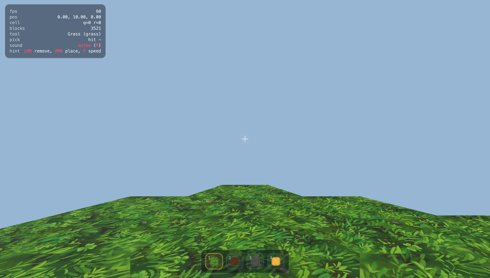

# HexWorld

HexWorld is a 3D sandbox block game built with Three.js, SvelteKit, and TypeScript.

You explore and build on a world made of vertical hex-prism blocks (hex base, vertical sides), inspired by voxel builders but with hex terrain logic.



## Gameplay

- World: procedural hex terrain with grass, dirt, stone, and sand blocks.
- Build loop: destroy with `LMB`, place with `RMB`, switch materials with `1-4`.
- Movement: `WASD`, fly up with `Space`, fly down with `Shift`.
- Camera: click the canvas to capture the mouse and control look; `Esc` unlocks/open menu.
- Audio: procedural place/break sounds, toggle mute with `M`.
- Utility: `R` regenerates world, `F` toggles fast movement.

## Project Vision

HexWorld is planned as a multi-biome educational exploration game.

Each biome will represent either:
- major natural eras/locations (for example Ice Age environments), or
- iconic human civilization sites (for example pyramid-era Egypt, Roman Colosseum, Eiffel Tower, Statue of Liberty).

Biomes are connected by portals so the player travels through a single connected world of time/place experiences.

## Development

```bash
npm install
npm run dev
```

Then open [http://localhost:5173](http://localhost:5173).

### Quality checks

```bash
npm run check
npm run build
```
